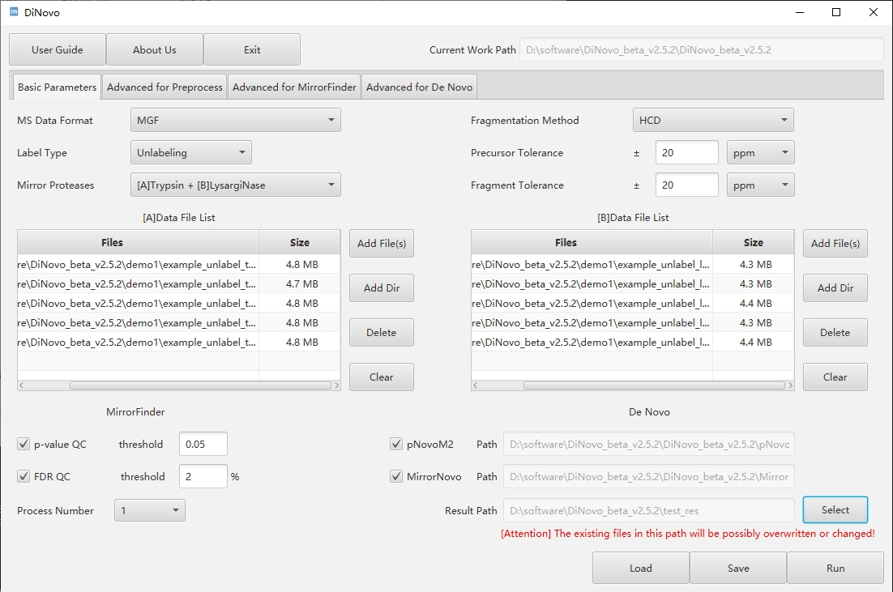

DiNovo is a software tool for automated, high-coverage and confidence *de novo* peptide sequencing from tandem mass spectra based on paired mirror proteases and deep learning. It currently supports trypsin & lysargiNase, and lysC & lysN. The kernel of DiNovo is written in Python3 and the graphical user interface is implemented in Java language in Windows Systems.

DiNovo can be used as a standalone executable, with GUI or command line.

Free for academic uses. Licensed under LGPL 3.0.

# Table of Contents
- [Features](#features)
- [Installation](#installation)
- [Getting Started](#getting-started)
- [Demo](#Demo)
- [Citation](#citation)

# Features

* **Mirror-Spectra Recognition** - Fast and accurate recognition of mirror spectral pairs based on a statistical scoring algorithm.
* ***De Novo* Sequencing** - Peptide sequencing from mirror spectral pairs, including MirrorNovo algorithm (deep learning based, running on GPU), and pNovoM2 algorithm (updated version of pNovoM, graph theory based, running on CPU).
* **Quality Control** - False discovery rate (FDR) estimation based on target-decoy strategies.
* **High Speed** - Whole-process acceleration based on multi-level index system and optimized multiprocess parallel strategy.
* **Easy to Use** - Friendly GUI design and optimized command-line interaction.

# Installation

**Hardware and OS requirements:** A computer with a 64-bit version Windows 10 (and above) is required to run DiNovo, and 16GB of RAM or more. To use MirrorNovo (deep learning-based sequencing algorithm), a GPU with 4GB memory at least is required.

**Environment setup:** To use MirrorNovo, the user needs to download and install [anaconda](https://www.anaconda.com/), [CUDA](https://developer.nvidia.com/cuda-downloads) (suitable version for your GPU), and [cuDNN](https://developer.nvidia.com/rdp/cudnn-archive#a-collapse764-10) (suitable version for your GPU).

**Installation:** To install the compiled standalone software of DiNovo, just unzip the *"standalone.zip"* file to a local folder (it takes a few seconds) and no further steps are needed.

For more detailed instructions, please refer to the *"DiNovo User Guide"*.

# Getting started

To  run the software, double click the *"DiNovo.exe"* to start the GUI and then:

1. ​**Set Basic Parameters**​  
   - Set the basic parameters like *"Mirror Proteases"*.

2. ​**Load Data Files**​  
   - Provide mass spectra datasets (.mgf format) in:  
     - `[A]Data File List`  
     - `[B]Data File List`

3. ​**Choose *De Novo* Algorithms**​  
     - ​**pNovoM2**​  
     - ​**MirrorNovo**​
    > Note: Select at least one *de novo* algorithm (both are enabled by default)

4. ​**Set Output Directory**​  
   - Specify the ​**Result Path**​ to save analysis results.

5. ​**Run Analysis**​  
   - Click the ​**Run**​ button to start processing.

For advanced configurations or command-line usage, see the *"DiNovo User Guide"*.

Example screenshot:  
  

# Demo

To run on the demo data, take the following steps:

1. ​**Load the *"demo.cfg"* Configuration File from the GUI**​  
   - The parameters will be automatically set, including input data and output path.

2. **Click the *Run* Button**
   - It takes a few minutes to complete the analysis on a typical desktop computer.

3. **Check the Results**
   - The results are saved in the *"demo_result"* folder.
   - The expected results are in the *"demo_expected_result"* folder for comparison.
   - Note that this demo dataset is only used to demonstrate the use of the software, and the sequencing results may not be correct. To test on larger dataset, please visit [DiNovo website](http://fugroup.amss.ac.cn/software/DiNovo/DiNovoIndex.html).

# Citation
   
**DiNovo: high-coverage, high-confidence *de novo* peptide sequencing using mirror proteases and deep learning ([bioRxiv 2025.03.20.643920](https://www.biorxiv.org/content/10.1101/2025.03.20.643920)).**

---

For more information about DiNovo and more test data, see [DiNovo website](http://fugroup.amss.ac.cn/software/DiNovo/DiNovoIndex.html).
